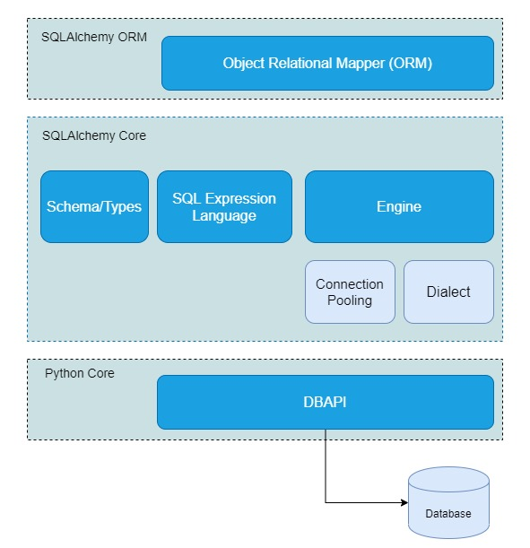

<center><h1>Object Relational Mapping </center>

## Konsep ORM


Object Relational Mapping (ORM) dalah sebuah teknik pemrograman yang mencoba untuk memetakan objek dengan database. ORM ini nantinya akan bertindak sebagai jembatan antara objek dari lingkungan bahasa pemrograman yang berorientasi objek (OOP) dengan lingkungan database relational. ORM dipilih karena manfaatnya yang lebih efisien dalam penulisan syntaks daripada syntaks database relational sendiri yang terlalu panjang. Bagi Anda yang terbiasa menggunakan SQL, Anda pasti merasakan betapa frustasinya Anda ketika menuliskan query yang sangat panjang belum ditambah jika hasil eksekusinya mengeluarkan error. Hadirnya ORM ini tentunya mempermudah bagi kita orang-orang yang sering bekerja dengan bahasa pemrograman berorientasi objek seperti Python, Java, dll. ORM dibuat agar objek dapat dipetakan atau direlasikan ke suatu record di database, ORM juga mengubah sintaks SQL menjadi sintaks yang bersifat object-oriented. Hal ini tentunya memudahkan programmer dan meningkatkan produktifitas dalam hal menggunakan database karena object sudah terhubung langsung dengan record-record pada database. Untuk jenis ORM sendiri sudah sangat banyak dikembangkan sesuai dengan bahasa pemrograman masing-masing. Kali ini, kita akan melihat salah satu contoh ORM yang ada di Python yaitu SQLAlchemy. Bahasa pemrograman Python sendiri juga memiliki beberapa ORM seperti DjangoORM, PonyORM, Storm, peewee, dll. SQLAlchemy dipilih karena karakteristiknya pada enterprise-level API yang membuat kode yang ditulis lebih robust dan adaptable serta designya yang fleksibel karena tidak membuat kita merasa 'sakit' ketika harus menulis query yang terlalu kompleks. Pembahasan mengenai SQLAlchemy dapat Anda temukan setelah kita membahas kelebihan dari ORM.

## Kelebihan ORM
- Mereduksi query yang sifatnya berulang. Hal ini tentunya akan mempercepat proses pengembangan program.
- Mengantisispasi adanya banyak error yang terjadi mengingat syntaks yang ditulis tidak akan sepanjang jika menuliskan query dengan database relational
- ORM menyediakan query berorientasi objek sehingga kita hanya akan fokus pada model objek dan tidak perlu khawatir dengan struktur database atau semantik SQL. ORM sendiri yang akan menerjemahkan query ke dalam sintaks yang tepat untuk database.

## SQLAlchemy



SQLAlchemy adalah library yang menjembatani komunikasi antara program Python dengan database. Library ini mencoba untuk menerjemahkan kelas-kelas di Python ke dalam tabel relasional dan juga mengkonversi fungsi-fungsi ke dalam perintah SQL. Dalam SQLAlchemy sendiri terdapat beberapa core yang perlu dipahami peran dan kegunaannya. Secara garis besar, SQLAlchemy dibagi menjadi 2 layer utama yaitu layer SQLAlchemy ORM dan SQLAlchemy Core. Untuk lebih jelasnya, kita akan mebahasanya satu per satu di bawah ini dengan merujuk gambar struktur SQLAlchemy di atas. Untuk dapat menggunakan SQLAlchemy, terlebih dahulu kita harus mengisntall librarynya dengan perinta seperti di bawah ini:
- Conda Installation
```
conda insttal -c sqlalchemy
```
- Pip Installation
```
pip install sqlalchemy
```


### DBAPI

Database API dibuat  untuk menentukan bagaimana modul Python yang berintegrasi dengan database menampilkan antarmukanya (user Interface). Kita akan melihat bagaimana fungsi-fungsi seperti `connect`, `commit`, `close` dan fungsi umum lainnya akan dijalankan ketika eksekusi (karena kita tidak akan berinteraksi secara langsung dengan API). Akibatnya, setiap kali kita menggunakan modul Python, kita akan sering menemukan fungsi-fungsi ini dan memastikan bahwa mereka akan berperilaku seperti yang diharapkan.

Pada pembahasan di artikel ini, kita akan menggunakan modul sqlite3 sebagai API. Modul ini menyediakan anatarmuka SQL yang sesuai dengan spesifikasi DBAPI 2.0  yand dideskripsikan oleh PEP 249.Pastikan di environment Anda terdapat modul dengan nama `sqlite3`. Modul ini biasanya secara otomatis akan terinstal ketika Anda membuat environment pertama kali. 

### SQLAlchemy Engine

Setiap kali kita menggunakan SQLAlchemy untuk berinteraksi dengan database, kita perlu membuat sebuah Engine. Engine ini secara khusus digunakan untuk mengelola 2 bagian, yaitu Pool dan Dialect. Intinya bagian ini digunakan SQLAlchemy untuk berinteraksi dengan fungsi pada DBAPI. 

Untuk dapat membuat Engine dan mulai berinteraksi dengan basis data, kita harus mengimpor fungsi `create_engine` dari library `sqlalchemy` dengan perintah seperti contoh di bawah ini:

```
import sqlalchemy as db
engine = db.create_engine('sqlite:///chinook.sqlite')
```
Kode di atas menjelaskan pembuatan sebuah sqlite engine untuk berkomunikasi dengan sebuah instance yang dijalankan secara lokal. Selain SQLite, SQLAlchemy juga mendukung RDBMS lainnya seperti PostgreSQL, MySQL, Oracle, dll. Jika Anda tertarik untuk membuat engine lain, Anda dapat melihat dokumentasi officialnya [disini](https://docs.sqlalchemy.org/en/11/core/engines.html)


### Connection Pooling
Connection Pool adalah implementasi dari `object pool pattern`. Object pool digunakan sebagai chace dari objek yang telah diinisialisasi dan siap digunakan. Program hanya akan mengambil objek dari sekumpulan objek yang ada dan menggunakannnya sesuai dengan kebutuhan kemudian mengembalikannya ketika sudah selesai. Artinya cara ini sebenarnya dilakukan untuk alasan penghematan karena dengan memanfaatkan pattern ini seperti yang kita tahu bahwa koneksi baru ke database akan menghabiskan waktu, sumber daya, dan biaya yang cukup mahal. Connection Pool juga menyediakan manajemen untuk jumlah total koneksi aplikasi yang mungkin digunakan secara bersamaan. Dalam kasus SQLite, SingletonThreadPool atau NullPool dipilih oleh Dialect untuk memberikan kompatibilitas yang lebih besar terhadap threading SQL dan penguncian modelnya, serta untuk memberikan perilaku default bahwa seluruh dataset dalam lingkup satu koneksi. Connection pooling ini dapat Anda atur pada fungsi `create_engine` dengan menambahkan parameter `pool_size`, `max_overflow`, `pool_recycle`, dan `pool_timeout`. Jika Anda tertarik untuk melakukan tuning pada connection pool, Anda dapat melihat dokumentasi officialnya [disini](https://docs.sqlalchemy.org/en/11/core/pooling.html#sqlalchemy.pool.QueuePool)

### SQLAlchemy Dialect
SQLALchemy mampu membuat Python untuk berkomunikasi dengan lebih dari satu database tetapi bisa menggunakan API yang sama. Hal ini membutuhkan satu bagian yang bernama Dialect. Umumnya database relational menggunakan standart dari SQL, namun memiliki `flavour` yang sedikit berbeda. Misalnya jika kita ingin mengambil 50 baris pada table `artists`, ketika kita menggunakan engine dari MySQL maka SQLALchemy untuk mengeksekusinya memerlukan perintah:
```
SELECT * FROM artists LIMIT 10;
```
Berbeda jika engine yang digunakan adalah Firebird, maka SQLAlchemy akan mengeksekusinya dengan perintah:
```
select first 10 id, name from artists
```
Karena engine yang sangat beragam, maka SQLAlchemy perlu mengetahui jenis database yang dihadapinya untuk memastikan dengan tepat permintaan apa yang akan dikeluarkan. Disinilah peran Dialect untuk membuat SQLAlchemy tahu dia akan berkomunikasi dengan database yang mana.

### Implementasi 
